# CAN 통신이란?

CAN 통신(Controller Area Network)은 차량 내에서 호스트 컴퓨터 없이 마이크로 컨트롤러나 장치들이 서로 통신하기 위해 설계된 표준 통신 규격이다. CAN 통신은 메시지 기반 프로토콜이며 최근에는 차량 뿐만 아니라 산업용 자동화기기나 의료용 장비에서도 종종 사용되고 있다. Controller Area Network (CAN)은 각 제어기들 간의 통신을 위해 주로 사용되는 non-host 버스 방식의 메시지 기반 네트워크 프로토콜이다.

---
* 1986년 Bosch사에 의해 공개되었다.
* 현재 생산되는 자동차에서 사용되고 있다.
* 우성 비트(dominant bit, 0)와 열성 비트(recessive bit,1)를 갖는다.

## 1. UART 통신과의 차이점?
UART 통신은 모듈이 추가될 때마다 연결선이 추가적으로 필요하다. 수 많은 연결선들은 비용의 증대와 공간의 비 효율성을 낳게 된다.

<p align="center">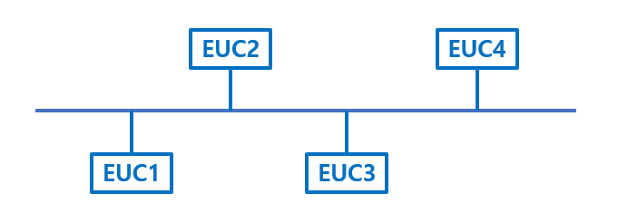</p>

CAN 인터페이스는 여러 개의 모듈을 처리할 수 있게 해주고, 선의 감소와 비용의 감소 공간의 효율성을 증대시켰다. CAN 통신은 여러 ECU를 병렬로 연결해 데이터를 주고받는다. CAN 버스를 통해 필요한 데이터에 접근할 수 있다.

## 2. CAN 통신의 특징

### 2.1 시리얼 통신 기반
> CAN 통신은 Serial Network 통신 방식의 일종이다. 여러 ECU를 병렬로 연결하여 서로 정보를 교환한다. 위의 그림을 보면 알 수 있듯이, 한 라인에 모든 노드가 연결되고 모든 노드는 같은 통신속도로 연결된다. 모든 노드는 같은 버스라인을 통해 데이터를 전송 및 수신한다.

### 2.2 Multi-Master
> 모든 CAN 구성 모듈은 정보 메시지 전송에 자유 권한이 있다. 즉, 통신 버스를 여러 노드들이 공유하면서 언제든지 버스를 사용할 수 있는 것이다.

### 2.3 간단하고 노이즈에 강하다
> CAN H, CAN L 두 개의 신호로 통신하기 때문에 선이 두개만 필요하다. 따라서 더 많은 모듈들이 추가되더라도 추가되는 선의 양이 적다는 이점이 있다. Twist Pair 구조로 되어 있기 때문에 노이즈에 강하다.

### 2.4 ID 값을 이용한 우선순위에 따라 처리한다
> 자동차의 ECU들은 고유한 ID 값을 가지고 있다. CAN 통신에서는 ID 값이 낮을수록 우선순위가 높은데, 여러 과정을 통해 설정된 ID 값을 수신하여 우선순위를 결정한다. 주소가 아니라 ID 값으로 메시지를 관리하기 때문에 시스템 제어 속도와 안전성을 향상할 수 있다. 낮은 우선순위의 메시지는 다음 bus cycle 때 재전송된다.

### 2.5 기타 CAN 통신의 특징
* CSMA(Carrier Sense Multiple Access)
* CD-CR(Collision Detection with Collision Resolution)
* 최대 8 BYTE 전송
* 주소 지정방식 X
* 비동기식 직렬 통신, 듀얼 와이어 접속 방식
* 고속 통신 및 신뢰성 / 안전성(에러 검출 및 처리 성능 우수)

## 3. CAN 통신의 장점
* 각각의 ECU들 간에 정보 교환이 이루어진다.
* 여러 장치를 2개의 선(Twisted Pair Wires)으로 컨트롤 할 수 있다.
* 통신이 되는 라인을 BUS-A(CAN H), BUS-B(CAN L)이라고 한다.
* 따라서 하나의 선에 에러가 나더라도 다른 선에 의해 정상적인 통신이 가능하다.

<p align="center">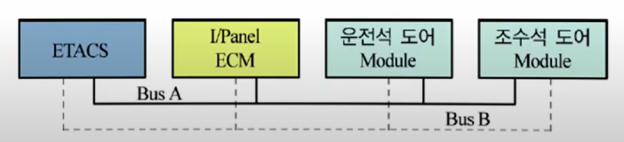</p>

CAN 통신은 전체 노드를 제어하는 Master가 없기 때문에 데이터에 쉽게 접근할 수 있다. ID값을 통해 불필요한 메시지를 무시하고 자신에게 필요한 메시지만 수신한다. 다중 노드가 동시에 버스에 메시지를 전송하려는 경우, ID값이 가장 낮은 정보를 가진 노드가 최 우선으로 버스에 접근하게 된다.

## 4. CAN Data Frame Format

<p align="center">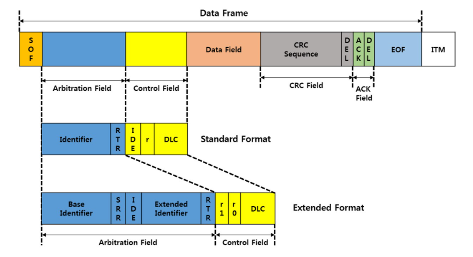</p>

* Arbitration Field : 메시지 ID가 있는 필드
* Control Field : 메시지 제어에 필요한 비트 값을 가지고 있는 필드, IDE 비트 값을 통해 프레임이 Standard Frame인지 Extended Frame인지 확인하고, DLC 비트를 통해 메시지 데이터의 길이를 알려준다
* Data Field : 실질적인 통신내용인 데이터가 있는 필드이다. CAN 메시지의 경우, 최대 8 Byte까지의 데이터를 메시지에 실을 수 있다
* Check Field : 변형된 데이터가 없는지 확인하는 CRC 값들이 있는 필드
* ACK Field : 메시지를 잘 수신했다는 것을 버스에 있는 다른 노드들에게 알려주는 값이 있는 필드

### 4.1 Standard CAN message format
메시지 ID, 식별자의 길이가 11 Bit인 형식이다. CAN 통신에서 메시지 ID는 메시지 고유의 이름일 뿐만 아니라, CAN 버스에서 2개 이상의 메시지 Collision이 일어날 경우 중재에 사용되는 우선순위의 역할도 가지고 있다. 과거 11 Bit로 충분한 크기의 범위였지만, 시간이 흐르고 메시지가 더 많이 필요해지게 되어 29 Bit의 메시지 ID를 갖고 있는 Extended Frame이 생기게 되었다.

<p align="center">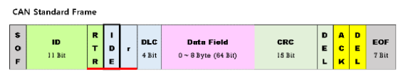</p>

* IDE 비트가 0이면, 프레임이 Standard Frame Format
* RTR 비트 : 데이터 프레임과 리모트 프레임을 구분하는 비트
* Arbittration Field는 ID 11비트와 RTR 비트까지의 필드 영역이다.
* Bitwise Arbitration 단계에서 RTR 비트까지 포함해 우선순위를 결정한다.
* 같은 ID를 가지고 있는 Frame이 버스에서 충돌난다면, RTR 비트가 dominant(0)인 Frame이 우위를 가지고 메시지를 전송한다.

### 4.2 Extended CAN message format
과거 Standrad Frame의 11 Bit로 충분한 양을 담을 수 있던 것과 달리, 시대가 발전함에 따라 더 많은 양을 처리해야 할 상황이 오게 되었다. 총 29 Bit 길이의 ID를 사용해서 더 많은 범위를 처리할 수 있다.

<p align="center">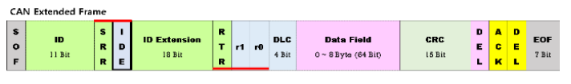</p>

* SRR(Substitute Remote Request) : Standard Frame의 RTR을 대신한다
* IDE(Identifier Extension Bit) : Extended id를 의미한다

### 4.3 Remote CAN message format
Remote Frame은 데이터 필드를 가지고 있지 않은 프레임이다. 메시지를 제대로 수신하지 못해서 해당 메시지의 재전송이 필요한 경우 전송되는 프레임이다. 모든 데이터를 정확히 수신해야 하거나, 대용량의 Data가 송수신되는 비행기 혹은 선박 업계에서 사용된다.

<p align="center">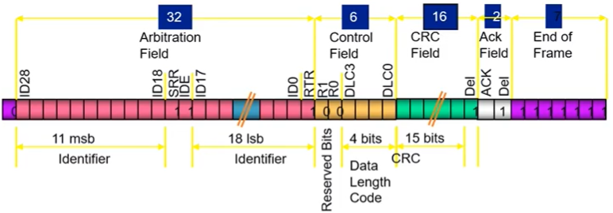</p>

* 다른 노드로부터 데이터 전송 요구를 알리는 프레임
* 데이터 요구를 나타내는 RTR 비트가 'r'로 설정되어 있으며 Data Field가 없다

### 4.4 Error CAN message format

<p align="center">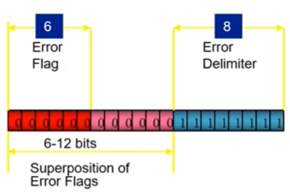</p>

* CAN에서 정의된 Error가 감지되면 전송
* Active Error Flag : 6개의 연속된 Dominant Bits
* Passive Error Flag : 6개의 연속된 Recessive Bits
* Superposition : Error Frame의 Bit Stuffing 오류가 감지된 다른 Node들의 Error Frame 전송으로 발생
* Error Delimiter : 8개의 연속된 Recessive Bits

## 5. MCP2515 CAN Bus Controller Module

### 5.1 MCP2515 간단한 특징
MCP2515 CAN Bus Controller Module은 CAN protocol version 2.0B을 지원하는 간단한 모듈이다. 최대 1Mbps의 속도로 사용이 가능하고, 1:1 통신 시스템을 구축하려면 2개의 CAN Bus Module이 필요하다.

<p align="center">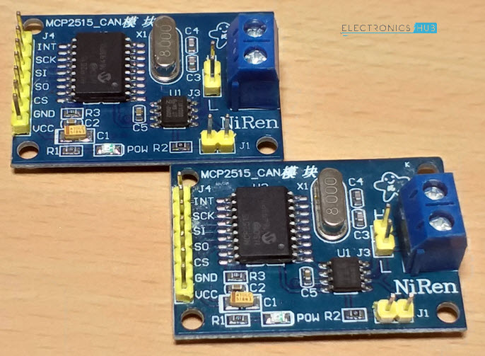</p>

### 5.2 Schemetic of MCP2515

<p align="center">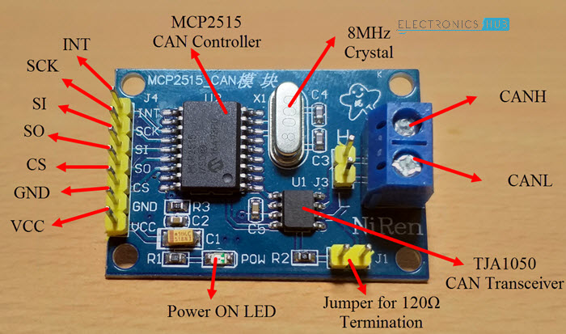</p>

MCP2515 CAN Bus Module에는 두 개의 IC 칩이 존재한다. MCP2515와 TJA1050 칩이다. 

#### 5.2.1 MCP2515
MCP2515는 메인 컨트롤러이며, CAN Module, Control Logic, SPI Block으로 구성되어 있다.

>* CAN Module : CAN Bus에서 메시지를 전송하고, 수신하는 것을 담당한다.
>* Control Logic : 모든 블록과 마주하며 MCP2515가 설정하고 동작하는 것들을 제어한다.
>* SPI Block : SPI 통신을 위한 인터페이스를 컨트롤한다.

#### 5.2.2 TJA1050
MCP2515 CAN Controller와 물리적 CAN Bus 사이의 인터페이스처럼 동작한다. TJA1050 IC 칩은 컨트롤러로부터 데이터를 받아서 Bus에 제공한다.

<p align="center">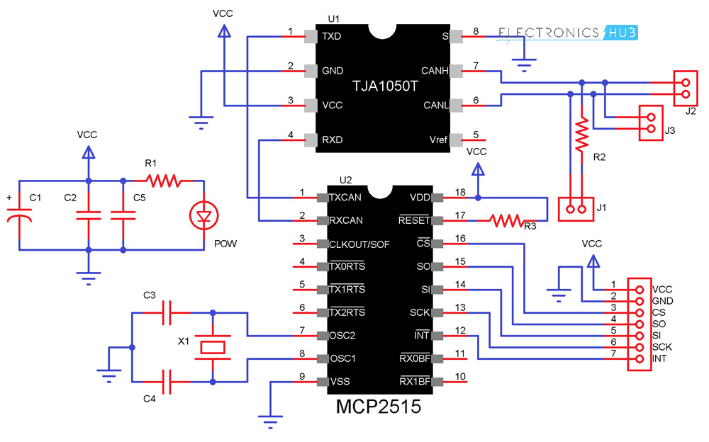</p>

### 5.3 회로도 구성하기(with Arduino UNO)

CAN Controller IC 칩이 MCU와 SPI 통신을 사용해 연결되기 떄문에, 아두이노의 SCK, SI, SO, CS핀을 연결해 주어야 한다.

<p align="center"></p>

## 6. MCP2515 사용해서 3대의 단말 통신하기 with 2 Arduino Uno & RPi4

### 6.1 시스템 구성도

<p align="center">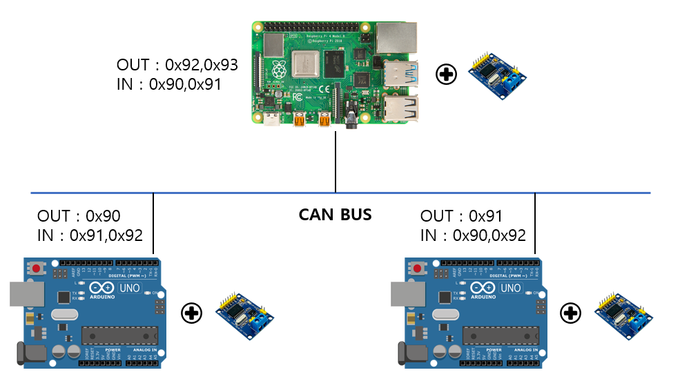</p>

### 6.2 라즈베리파이 및 아두이노 초기 설정 (중요)

#### 6.2.1 라즈베리파이의 CAN 통신
라즈베리파이에서는 기본적으로 CAN통신을 위한 준비가 되어있지 않다(Raspberry Pi boards aren't ready out-of-the-box for CAN.). 라즈베리파이의 GPIO에서는 하드웨어적으로 CAN통신을 지원하지 않고, 라즈비안 운영체제는 소프트웨어적으로 CAN통신을 지원하지 않는다.

> 하드웨어적인 제한을 해결하기 위해 SPI 통신을 사용하고, 소프트웨어적인 제한을 해결하기 위해 CAN Controller 모듈을 사용한다(mcp251x family).

<p align="center">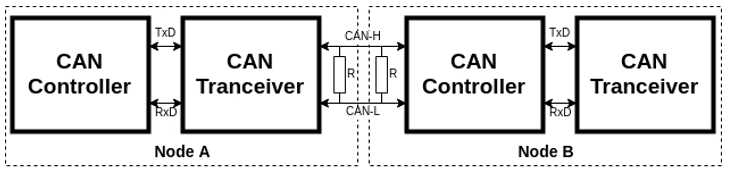</p>

* CAN Controller - SPI통신을 통해 마이크로컨트롤러의 통신 인터페이스 형성
* CAN Tranceiver - CAN Bus 레벨에서의 데이터 통신(send/receive)

CAN Controller와 CAN Tranceiver는 TxD, RxD wire로 통신한다.

* TxD - Transmit Data, 데이터 송신을 위한 선
* RxD - Receive Data, 데이터 수신을 위한 선

#### 6.2.2 SPI 통신을 사용하는 이유?

라즈베리파이의 GPIO 핀과 아두이노의 핀맵에서는 내장 CAN-Bus를 가지고 있지 않음. 하지만 SPI통신을 위한 내장 SPI-Bus를 가지고 있다(SCK, MOSI, MISO, CS ...). 또한 필요한 경우에 Interrupt 처리를 위한 핀 역시 내장하고 있음.

<p align="center">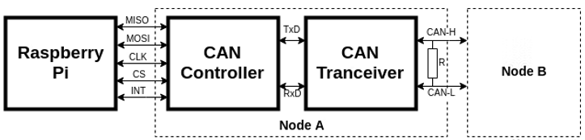</p>

#### 6.2.3 라즈베리파이 핀 구성도

<p align="center">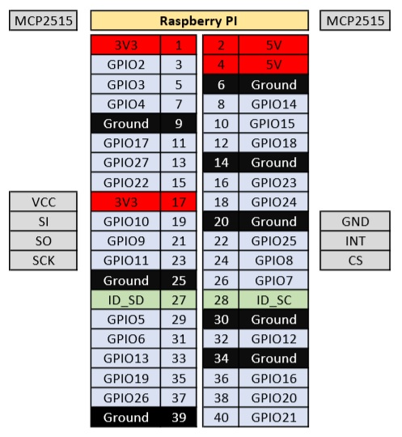</p>

#### 6.2.4 라즈베리파이 소프트웨어 설정하기
> 사용 운영체제 - Raspberry Pi OS (32-bit) Bullseye

최신 버전의 라즈비안에서는 mcp251x 모듈에 대한 지원을 하고 있다(리눅스 커널 접근 가능). 따라서 can 모듈을 다른 하드웨어처럼 direct로 로드해서 사용하면 된다.

1. SPI / CAN Configuration

```
sudo nano /boot/config.txt
```
```
sudo vim /boot/config.txt
```

2. 해당 내용 작성 (interrupt와 oscillator는 각자에 맞게 수정)

```
dtparam=spi=on
```
```
dtoverlay=mcp2515-can0,oscillator=8000000,interrupt=25
dtoverlay=spi0-hw-cs
```

3. 테스트하기
```
dmesg | grep -i spi
```
```
dmesg | grep -i can
```
```
ifconfig
```
라즈베리파이에서는 CAN통신을 하나의 네트워크로 인식하기 때문에, ifconfig로 확인 가능하다.

<p align="center">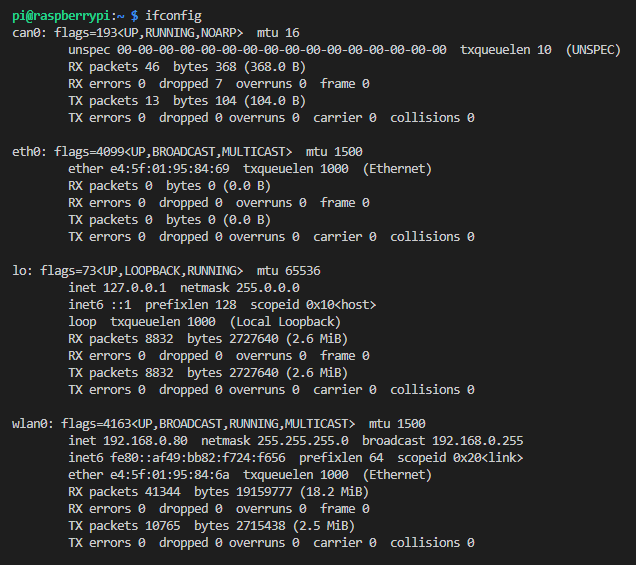</p>

```
sudo ip link set can0 up type can bitrate 500000
```
can0 인터페이스를 같은 속도로 맞춰줘야 한다.

### 6.3 작동 원리

#### 6.3.1 라즈베리파이
1. 리눅스에서 제공하는 can 관련 헤더파일과 쓰레드 헤더파일 사용
2. 2개의 추가 쓰레드 생성 후 사용(데이터 수신, 데이터 송신 전용)
3. 순서 - can 소켓 생성, 송신 쓰레드 생성, 수신 쓰레드 생성(무한 루프)

<hr/>

헤더파일 선언
```C
#include <stdio.h>
#include <string.h>
#include <stdlib.h>

#include <fcntl.h> // 파일 처리를 위한 헤더파일
#include <unistd.h> // POSIX 운영체제 API 엑세스 제공 헤더파일

#include <pthread.h> // 쓰레드 헤더파일
#include <arpa/inet.h> // hton, ntoh , htons, ... etc

#include <sys/socket.h> // socket, bind, listen, ...
#include <sys/types.h>
#include <sys/ioctl.h>
#include <netinet/in.h> // sockaddr_in 
#include <net/if.h>

#include <stdint.h>

#include <linux/can.h>
#include <linux/can/raw.h>

#include <wiringPi.h> // GPIO 제어를 위한 헤더파일

```

<hr/>

전역변수 선언
```C
int led_green = 23;
int led_blue = 24;

int btn_green = 20;
int btn_blue = 21;

/* ============== GLOBAL variables ============== */
static int can_socket; // CAN socket
static struct sockaddr_can addr;
static struct ifreq ifr; // ifreq structure contaning the interface name
/* ============================================== */
```

<hr/>

CAN 소켓 생성 및 초기화, bind
```C
void init_bind_socket_can(){

	/* ======================  Create Socket using 3 parameters ======================
	domain/protocol family(PF_CAN), type of socket(raw or datagram),socket protocol */
	if((can_socket=socket(PF_CAN,SOCK_RAW,CAN_RAW)) < 0){
		perror("Socket");
		return;
	}

	/* Retrieve the interface index for the interface name(can0, can1, vcan0, etc ... ) */
	strcpy(ifr.ifr_name,"can0");

	/* 네트워크 관리 스택 접근을 위한 I/O controll, 사용자 영역에서 커널 영역의 데이터 접근(system call) using 3 parameters
	an open file descriptor(s), request code number(SIOCGIFINDEX), value */
	ioctl(can_socket,SIOCGIFINDEX,&ifr);

	// Bind Socket to the CAN interface
	memset(&addr,0,sizeof(addr));
	addr.can_family = AF_CAN;
	addr.can_ifindex = ifr.ifr_ifindex;

	if (bind(can_socket,(struct sockaddr *)&addr, sizeof(addr)) < 0){
		perror("Bind");
		return;
	}

	printf("CAN Socket creation & bind success!\n");
}
```

<hr/>

데이터 수신 쓰레드 함수 , ID에 따른 분기 처리
```C
void* thread_func(void* arg){
    int nBytes;
    int csock = *((int*)arg);
    struct can_frame recieve_frame;

    nBytes = read(csock,&recieve_frame,sizeof(struct can_frame));
    if(nBytes < 0){
        perror("Read");
        return NULL;
    }

    switch(recieve_frame.can_id){
        case 0x90:
            printf("Green LED ON!\n");
            printf("0x%2X {%d} ",recieve_frame.can_id,recieve_frame.can_dlc);
            for(int i=0;i<recieve_frame.can_dlc;i++){
                printf("%X ",recieve_frame.data[i]);
            }
            printf("\r\n");
            digitalWrite(led_green,1);
            delay(10);
            digitalWrite(led_green,0);
            break;

        case 0x91:
            printf("Blue LED ON!\n");
            printf("0x%2X {%d} ",recieve_frame.can_id,recieve_frame.can_dlc);
            for(int i=0;i<recieve_frame.can_dlc;i++){
                printf("%X ",recieve_frame.data[i]);
            }
            printf("\r\n");
            digitalWrite(led_blue,1);
            delay(10);
            digitalWrite(led_blue,0);
            break;
        default:
            break;
    }
    
}
```

<hr/>

데이터 송신 쓰레드함수, id값을 설정하여 write한다.
```C
void* thread_send_func(void* arg){
    int csock = *((int*)arg);
    struct can_frame send_frame;

    while(1){
        // code 작성하기
        if(digitalRead(btn_green)==1){
            send_frame.can_id = 0x92;
            send_frame.can_dlc = 8;
            printf("Green button pushed!\n");
            if(write(csock, &send_frame, sizeof(struct can_frame)) != sizeof(struct can_frame)){
                perror("Write");
                return NULL;           
            }
            delay(500);
            continue;
        }
        if(digitalRead(btn_blue)==1){
            printf("Blue button pushed!\n");
            send_frame.can_id = 0x93;
            send_frame.can_dlc = 8;
            if(write(csock, &send_frame, sizeof(struct can_frame)) != sizeof(struct can_frame)){
                perror("Write");
                return NULL;           
            }
            delay(500);
            continue;
        }
    }
}
```

<hr/>

메인 함수, 쓰레드 생성 및 소켓 초기화
```C
int main(){
    
    pthread_t thread;
    pthread_t send_thread;

    struct can_frame recieve_frame;
	struct can_frame send_frame;

    if(wiringPiSetupGpio()==-1){
        perror("wiringPiSetup");
        return 1;
    }

    init_bind_socket_can(); // 소켓 초기화

    pinMode(led_green,OUTPUT);
    pinMode(led_blue,OUTPUT);

    pinMode(btn_green,INPUT);
    pinMode(btn_blue,INPUT);

    // 송신 전용 쓰레드 생성
    pthread_create(&send_thread,NULL,thread_send_func,&can_socket);

    // 무한 루프를 돌며 쓰레드를 사용해 데이터 수신
    while(1){
        pthread_create(&thread,NULL,thread_func,&can_socket);
        //pthread_join(thread,NULL);
    }


    if (close(can_socket) < 0) {
		perror("Close");
		return 1;
	}

}
```

#### 6.3.2 아두이노
아두이노에는 쓰레드가 존재하지 않기 때문에, 인터럽트를 사용해 데이터 수신을 관리한다. mcp2515의 인터럽트 핀을 사용하고자 하는 아두이노의 핀에 연결한다. 또한 CAN통신을 사용하기 위해서 "MCP2515-lib-master" 라이브러리를 추가한다.

<hr/>

헤더파일 및 전역변수 선언
```CPP
// 3대의 단말이 하나의 BUS LINE으로 통신하는 프로그램 연습

#include <SPI.h>
#include <mcp_can.h>

MCP_CAN CAN(10);
int led_pin = 7;
int btn_pin = 6;
```

<hr/>

인터럽트 발생 시 동작하는 함수 선언, id값에 따른 분기 처리
```CPP
void CAN_INT(){
    unsigned char len = 0;
    unsigned char buf[8];
    

    CAN.readMsgBuf(&len,buf); // CAN 데이터 가져오기
    unsigned long canId = CAN.getCanId(); // CAN ID 얻기
    switch (canId)
    {
    case 0x91:
        Serial.print("\nData from ID : 0x");
        Serial.println(canId,HEX); // 16진수로 ID 출력
        for(int i=0;i<len;i++){
            Serial.print(buf[i]);
            Serial.print("\t");
        }
        Serial.print("\n");
        digitalWrite(led_pin,HIGH);
        delay(1000);
        digitalWrite(led_pin,LOW);
        break;
    
    case 0x92:
        Serial.print("\nData from ID : 0x");
        Serial.println(canId,HEX); // 16진수로 ID 출력
        for(int i=0;i<len;i++){
            Serial.print(buf[i]);
            Serial.print("\t");
        }
        Serial.print("\n");
        digitalWrite(led_pin,HIGH);
        delay(1000);
        digitalWrite(led_pin,LOW);
        break;
    
    default:
        break;
    }
    
}
```

<hr/>

setup 초기설정, 인터럽트 설정을 해 주어야 한다
```CPP
void setup(){
    Serial.begin(115200);
    pinMode(led_pin,OUTPUT);
    pinMode(btn_pin,INPUT);
    while(CAN_OK != CAN.begin(CAN_500KBPS,MCP_8MHz)){
        Serial.println("CAN BUS init failed!");
        delay(100);
    }
    Serial.println("CAN BUS init Success!");
    // 2번 핀 인터럽트 설정(falling 때), 인터럽트 들어오면 CAN_int 함수 실행
    attachInterrupt(digitalPinToInterrupt(2),CAN_INT,FALLING);
}
```

<hr/>

loop 함수 아두이노 동작 코딩, 버튼을 누를 때 데이터를 송신한다
```CPP
unsigned char data[8] = {0,1,2,3,4,5,6,7};
    if(digitalRead(btn_pin)==HIGH){
        CAN.sendMsgBuf(0x90,0,8,data);
        Serial.println("Button pushed, Data send");
        delay(1000);
    }
```

<hr/>

### 아두이노는 총 2대지만, 하나의 코드만 올려 놓았다. 보내는 데이터와 id값, 받는 id에 따른 분기 처리만 바꾸면 되기 때문이다. 적절하게, 사용에 맞게 해당 부분만 수정하면 된다. 자세한 방법은 소스 코드를 참고하면 된다.

<hr/>

## 7. 마무리 및 결과 사진
이번 미니 프로젝트의 목표는 1:1 통신을 넘어서 3대 이상의 멀티 단말들이 CAN 통신을 사용해 데이터를 주고받을 수 있게 구현하는 것이었다. mcp2515 모듈을 3개 가지고 있었기 때문에 3대의 multi-master로, 그리고 모두 같은 종류의 단말이 아니라 다른 종류의 단말끼리도 통신을 구현해보고자 했다.

라즈베리파이의 경우 네트워크를 사용한 통신이 가능하기 때문에 CAN통신으로 받은 데이터를 더 확장성 있게 사용할 수 있을 것으로 보인다.

<hr/>

### 최종 결과

<p align="center">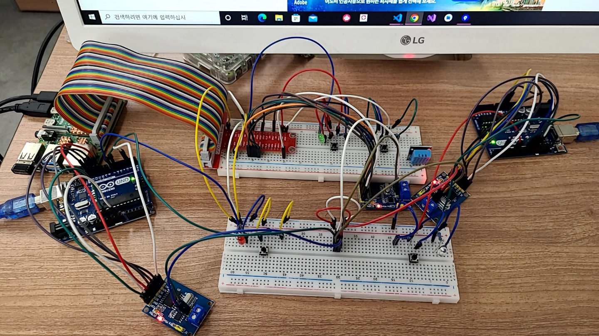</p>

<hr/>

### 구동 화면